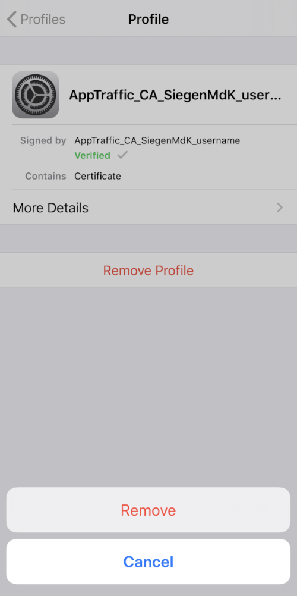

# Removal of configuration profiles installed on iOS devices

After using AppTraffic, if you wish to remove the configuration profiles installed on your iOS device, please follow the instructions as follows. 

1. Open `Settings` on your iOS device.  Scroll down to `General`.  Tap `General`.

2. Scroll down to `Profiles`.  Tap `Profiles`.

3. You should see the two configuration profiles related to AppTraffic.  Tap one of these profiles to open the profile.   

4. Tap `Remove profile`

5. Enter the passcode to your device

6. Tap `Remove`

7. One profile related to AppTraffic remains on the list.  Tap the remaining profile.  

8. Tap `Remove profile`

9. Enter the passcode to your device

10. Tap `Remove`

11. All AppTraffic-related profiles are removed.

